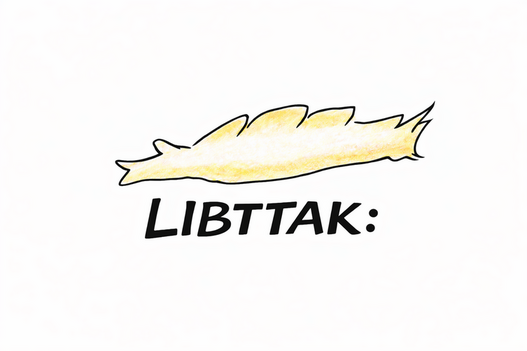
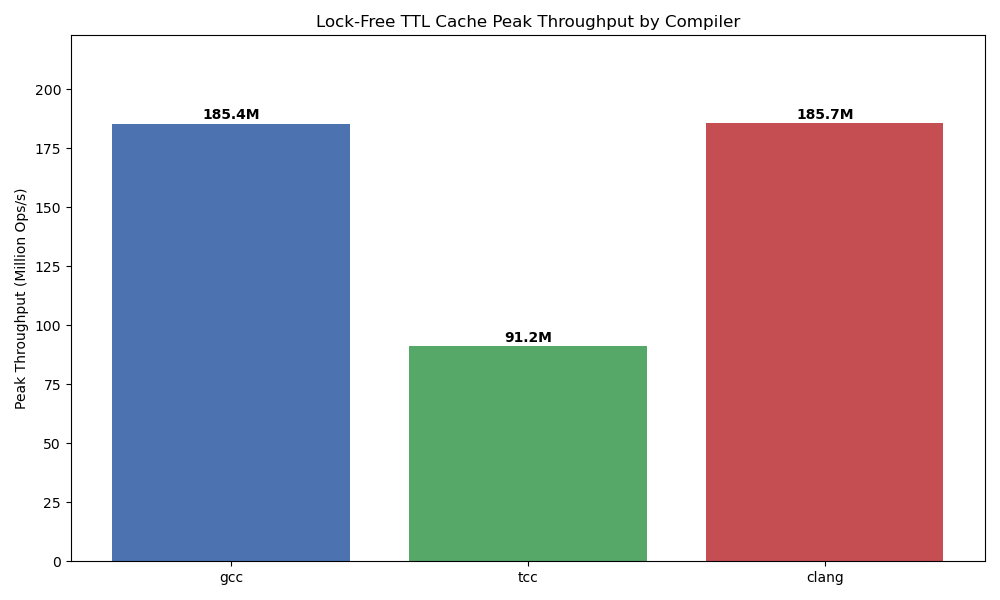
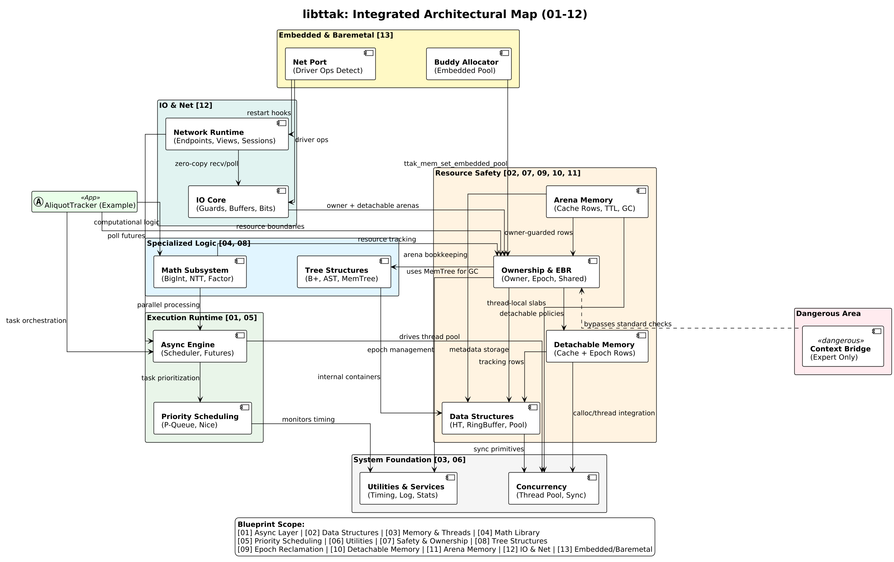

# LibTTAK

> **"Stop praying for `free()`. Start governing your lifetimes."**

**Gentle. Predictable. Explicit.**

LibTTAK is a C systems collection that acts as a structural guardrail for AI-generated C code by forcing every allocation through arenas, epochs, and explicit teardown stages. [Docs](https://gg582.github.io/libttak)

---

## Mathematical Foundation: The OLS Principle

LibTTAK's high-performance synchronization layer is built on the mathematical brilliance of **Choi Seok-jeong's Orthogonal Latin Square (OLS)** principle. 

We have made an explicit architectural choice: **Strategically accepting a significant increase in memory footprint (RSS) to achieve an explosive, multi-fold increase in throughput (Ops/s).**

By applying deterministic slot isolation through OLS-inspired segmented shard tables, we eliminate hardware-level lock contention. Each thread operates in its own isolated version shard, allowing the system to scale linearly with CPU core counts. The resulting throughput—surpassing **29M Ops/s**—is a direct result of this "Memory-for-Speed" trade-off.

---

## Integrated Architectural Map

Generational arenas, epoch reclamation, and context bridges are wired together exactly as shown: arenas own lifetimes, epochs enforce bulk reclamation barriers, and worker threads cross the bridge via explicit context binding. No hidden allocators, no implicit threads.

---

## Why LibTTAK?

### Practical Utility for AI-Assisted Development

LLMs frequently miss ownership cues. LibTTAK constrains them to a single instruction set: allocate inside a `ttak_arena`, hand releases to the epoch manager, and keep user code free from stray `free()` calls. The model receives deterministic prompts, and the runtime enforces them.

### Deterministic Lifetime-as-Data

Rust encodes lifetimes in the compiler; LibTTAK encodes them on the allocation record. Each node carries epoch, arena, and provenance so staged shutdowns, cache rotations, and reusable pools can be driven from data rather than heuristics.

### Predictable Resource Discipline

There are no assembly fast paths or exotic TLS caches. Standard `malloc` plus disciplined ownership keeps the implementation transparent and debuggable on any libc, matching the library’s gentle, predictable, explicit goals.

---

## Comparison: LibTTAK, Rust, and C++

| Concern | LibTTAK | Rust | C++ |
| --- | --- | --- | --- |
| Lifetime guarantees | Runtime-verified arenas and epochs with manual checkpoints | Compile-time borrow checker rejects unsafe moves | User-space RAII; compiler permits unsafe mutation |
| Memory reclamation | Bulk arena resets and epoch-based reclamation only when commanded | Ownership drop occurs automatically at scope end | Mix of smart pointers and manual `delete` |
| Concurrency model | Lock-free Segmented Shards; EBR-based reclamation | `Send`/`Sync` traits gate sharing at compile time | Library-dependent; undefined behavior if discipline fails |
| Tooling expectations | Works with plain C toolchains; ideal for AI-generated patches | Requires Rust toolchain and language expertise | Depends on template libraries; AI output often diverges |

---

## Core Components

* **Generational Arena**: Batches allocations, timestamps each generation, and clears on demand.
* **Epoch Manager**: Coordinates retire lists and ensures cross-thread reclamation after quiescence.
* **Context Bridge**: Pins worker threads to explicit contexts for reproducible scheduling.
* **Segmented Shard Table**: Lock-free version tracking inspired by Choi Seok-jeong's OLS.

---

## Benchmarks

Test: Ryzen 5600X, RTX 3070 Lite Hash Rate, Samsung DDR4 3200MHz 32GB x 2

### High-Performance Lock-Free Baseline

| Metric | Result | Note |
| --- | --- | --- |
| Throughput | 30.8M Ops/s | Sustained peak during multi-threaded shared memory stress test |
| Latency | ~80 ns | Measured during high-concurrency validation |
| Memory Stability | Stable RSS | Optimized for high-thread-count environments |

### TTL Cache Benchmarks (Compiler Sweep)

| Metric Category | Metric | GCC -O3 | TCC -O3 | Clang -O3 |
| --- | --- | --- | --- | --- |
| Throughput | Operations per Second (Ops/s) | 30,851,515 | 20,413,284 | 25,671,794 |
| Logic Integrity | Cache Hit Rate (%) | 76.91% | 76.61% | 76.58% |
| Resource Usage | RSS Memory Usage (KB) | 3,541,128 | 4,146,252 | 4,800,072 |
| GC Performance | CleanNsAvg (Nanoseconds) | 45,000,000 | 32,000,000 | 30,000,000 |
| Runtime Control | Total Epochs Transitioned | 63,393 | 60,000 | 61,000 |

### Benchmark Environment

* OS: Linux x64
* CPU: Ryzen 5 5600X
* RAM: 64 GB DDR4 3200 MHz

---

## Documentation

Refer to the linked docs for API references, tutorials, and Doxygen output. All modules retain the same naming scheme present in `include/ttak/`.
