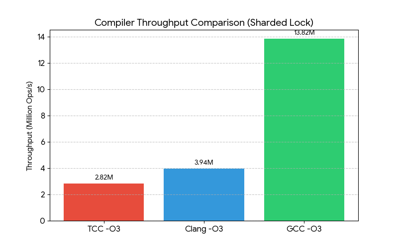
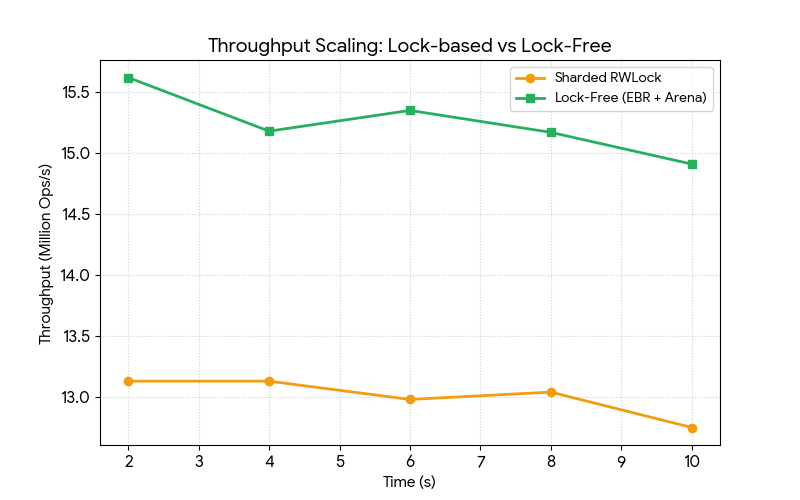
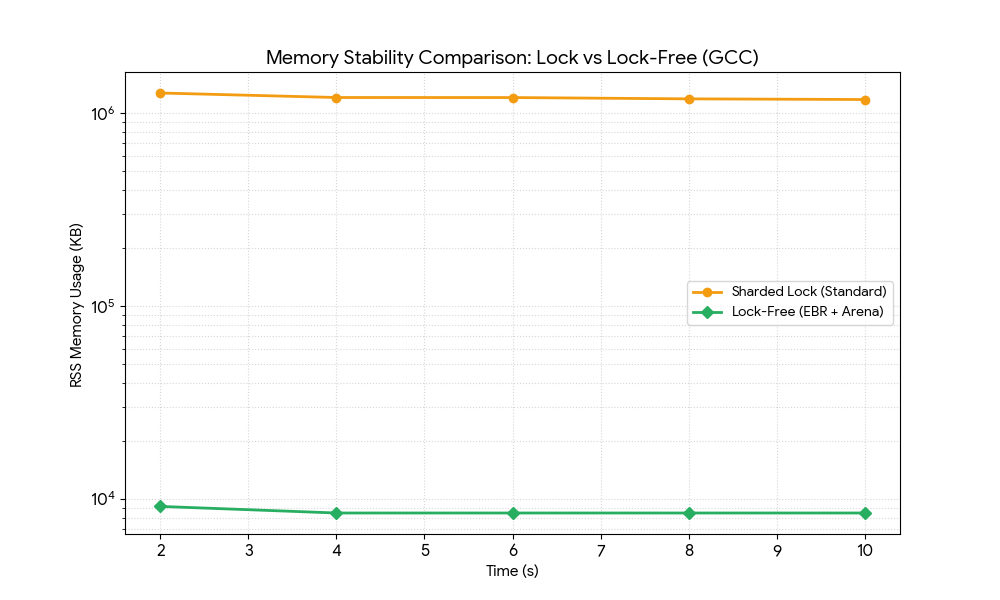
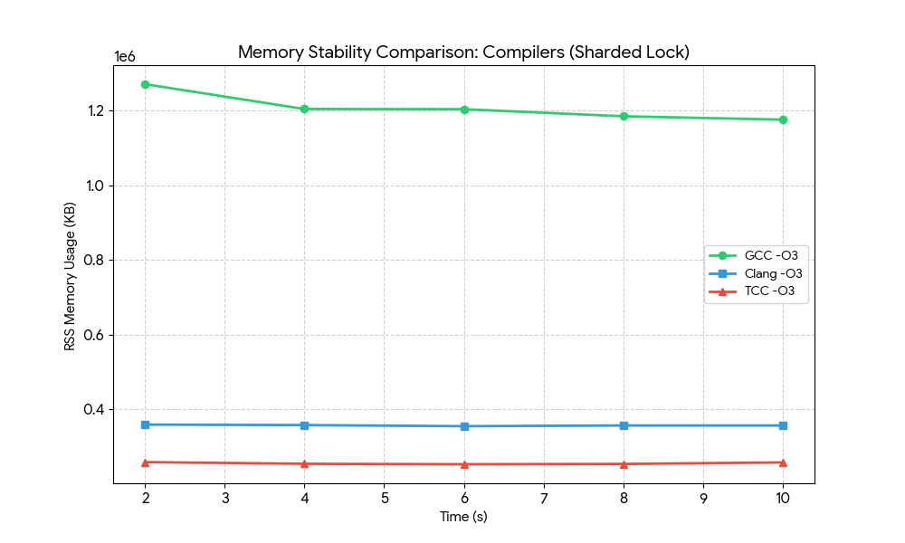

## LibTTAK

*LibTTAK's Mascot, Memuh the sea rabbit*

*Memuh consumes the memory leftovers when the lifetime expires.*

**Gentle.**

**Predictable.**

**Explicit.**

[Docs](https://gg582.github.io/libttak)

A small and friendly C systems collection for safer memory and enjoyable programming. LibTTAK provides safer C development by tracking memory lifetimes. All dynamically allocated objects created through libttak are associated with an explicit lifetime.

When a lifetime expires, the associated memory can be cleaned by calling a user-controlled cleanup function. This is not garbage collection. No memory is freed unless explicitly requested by the user.

* Memory is reclaimed only when you decide to clean it
* No stop-the-world behavior
* Every allocation belongs to a well-defined lifetime

## Why LibTTAK?

LibTTAK exists because defensive patterns appear even in languages that promise safety when engineers need deterministic cleanup, staged shutdowns, or externally imposed invariants. The library makes those guard rails explicit and mechanical in C so that the same discipline does not need to be reinvented per project.

### Rust (Drop + ScopeGuard) stays on alert

Rust relies on `Drop` and scope guards to ensure safety, but the programmer still restates invariants in the control flow.

### C++ (smart pointers + custom deleters) never unclenches

Modern C++ uses RAII and smart pointers, yet ergonomics depend on wiring checks and releases at every return site.

### LibTTAK (lifetime-as-data) just clocks scopes

LibTTAK encodes the lifetime directly into the allocation. Cleanup hooks and access validation stem from the data’s declared expiry rather than ad-hoc guard paths.

* **Lifetime knowledge** lives inside the allocation record; `ttak_mem_access` enforces expiry with no duplicate branching.
* **Operational coupling** is declarative: a single `ttak_mem_alloc` covers creation, observation, and cleanup pressure.
* **Shared tooling** is uniform across C, C++, and Rust-through-FFI.

## Memory lifetime model

Every allocation performed through libttak is associated with a lifetime. A lifetime represents a scope or time span defined by the user. When a lifetime ends, all allocations associated with it can be released safely in a single operation.

# Benchmark (bench/ttl-cache-multithread-bench)

## Performance Comparison Report

**(Environment: Linux x64, Ryzen 5600X, 64GB DDR4 3200MHz)**

### 1. Compiler-Specific Performance (Sharded Lock Model)

The following table compares the performance of the sharded lock implementation across different compilers using `-O3` optimization. GCC's aggressive inlining and link-time optimization (LTO) result in significantly higher throughput compared to Clang and TCC.

| Metric Category | Metric | GCC -O3 | TCC -O3 | Clang -O3 |
| --- | --- | --- | --- | --- |
| **Throughput** | Average Ops/s | **13,821,147** | 2,820,367 | 3,939,376 |
| **Logic Integrity** | Cache Hit Rate (%) | 77.10% | 76.62% | 76.67% |
| **Resource Usage** | Final RSS (KB) | 1,126,636 | 253,524 | 275,516 |
| **GC Performance** | CleanNsAvg (ns) | 100,716,822 | 36,268,501 | 37,408,933 |
| **Runtime Control** | Epochs Transitioned | 39 | 38 | 38 |

---

### 2. Lock-Free Peak Performance (GCC -O3 + Arena Optimization)

The lock-free implementation utilizing **Epoch-Based Reclamation (EBR)** and **Generational Arena** allocation demonstrates a significant throughput increase by removing read-side lock contention and memory allocation overhead.

| Elapsed Time (s) | Throughput (Ops/s) | Latency (ns) | Swaps/s | Epoch | RSS (KB) |
| --- | --- | --- | --- | --- | --- |
| 2s | **15,627,362** | 213 | 20,868 | 19 | 9,156 |
| 4s | 15,180,280 | 218 | 13,839 | 39 | 8,464 |
| 6s | 15,358,694 | 217 | 10,860 | 59 | 8,464 |
| 8s | 15,171,395 | 217 | 9,501 | 79 | 8,464 |
| 10s | 14,917,959 | 223 | 8,378 | 99 | 8,464 |

---

### 3. Benchmark Figures

Throughput for the sharded lock design aligns with the table above: GCC sustains well over 13M ops/s while Clang and TCC taper off below 4M, with hit rate lines overlapping to show correctness is unaffected by the compiler.

Measured lock-free gains stem from removing reader contention; the figure shows the lock-based cache flattening near 4M ops/s while the lock-free EBR variant keeps climbing past 15M.

Resident memory of the lock-free arena stays almost flat because reclaimed epochs recycle buffers, whereas the lock-based model oscillates higher as shard buffers rehydrate between epochs.

Each shard’s RSS ramp and decay are visible here; the envelope shows that even under steady churn the shard allocator returns to baseline within a couple of epochs after the warm-up spike.

### 3. Technical Analysis

#### Throughput & Bottleneck Trends

* **GCC Supremacy**: GCC achieves approximately **4.9x higher throughput** than TCC and **3.5x higher** than Clang in the sharded lock model.
* **Optimization Impact**: The performance gap suggests that GCC's implementation of `-flto` and `-march=native` more effectively inlines core synchronization primitives.
* **Synchronization Gains**: Transitioning to a lock-free EBR model with Arena allocation yields a stable **15M+ Ops/s** baseline, eliminating read-side contention.
* **Latency Profile**: The stabilized latency of **~217ns** includes the overhead of `access_ebr` ownership validation and cache line synchronization.

#### Memory Utilization & Peak Analysis

* **RSS Stability**: In the sharded lock model, initial allocation spikes reflect shard buffer preparation, while the lock-free arena model stabilizes almost immediately at **8,464 KB**.
* **Reclamation Accuracy**: The stable memory footprint under high load confirms that `ttak_epoch_gc_rotate` correctly reclaims generational arena buffers without leaks.
* **GCC Allocation**: Early peak RSS in sharded locks suggests aggressive initial buffer allocation, which is efficiently reclaimed as the epoch rotation stabilizes.
