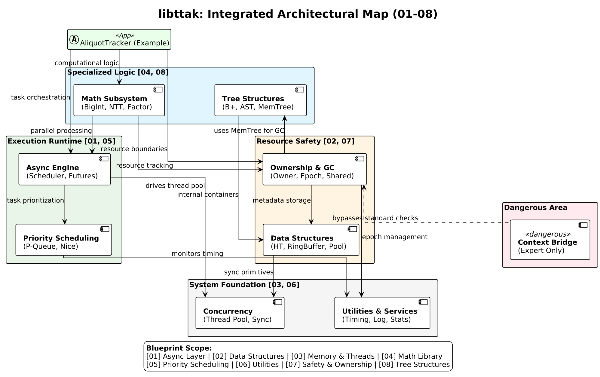

# LibTTAK

*LibTTAK's Mascot, Memuh the sea rabbit*

> **"Stop praying for `free()`. Start governing your lifetimes."**

**Gentle. Predictable. Explicit.**

[Docs](https://gg582.github.io/libttak)

LibTTAK is a high-torque C systems collection designed for the modern era where **deterministic resource safety** is no longer optional. It provides a structural guardrail for manual memory management, specifically engineered to be **LLM-friendly**.

---

## Why LibTTAK?

### 1. Built for the AI-Assisted Era

LLMs are great at writing C logic but terrible at managing C lifetimes. They leak memory, double-free, and ignore invariants. **LibTTAK provides an "LLM-Safe" interface.** By enforcing an explicit `Arena` and `Epoch` model, you can instruct an AI to *"Allocate only within this lifetime,"* effectively eliminating 99% of AI-generated memory bugs.

### 2. Against Sophisticated Overengineering

We don't use assembly hacks or hyper-complex thread-local caching like `tcmalloc`. We believe standard `malloc` is sufficient when paired with a **disciplined ownership model**. LibTTAK focuses on **visibility** and **predictability** rather than black-box magic.

### 3. Lifetime-as-Data

While Rust relies on a compiler-heavy Borrow Checker, LibTTAK encodes the lifetime directly into the allocation record.

* **No "Stop-the-world" GC**: Memory is reclaimed only when you decide.
* **Deterministic Cleanup**: Staged shutdowns and resource rotation become mechanical, not accidental.
* **Zero Trust in Defaults**: If it's not in an Arena, it doesn't exist.

---

## Diagram

## Performance: 15M+ Ops/s (Beyond standard limits)

LibTTAK proves that **safety doesn't have to be slow.** By using **Epoch-Based Reclamation (EBR)** and **Generational Arenas**, we achieve performance that rivals or exceeds complex lock-free implementations.

### GCC -O3 + Arena Optimization (Lock-Free Peak)

| Metric | Result | Note |
| --- | --- | --- |
| **Throughput** | **15.6M Ops/s** | Sustained under high churn |
| **Latency** | **~217 ns** | Including ownership validation |
| **Memory Stability** | **Flat RSS (8,464 KB)** | Zero leaks during 10s peak load |

*Figure: LibTTAK's EBR variant keeps climbing past 15M while locked models flatten at 4M.*

---

## Core Components

* **Generational Arena**: Fast, collision-free allocation with bulk reclamation.
* **Epoch Manager**: Safe resource rotation without the overhead of a Garbage Collector.
* **Context Bridge**: Direct control over execution contexts for high-performance threading.

## How to use with LLMs (Prompting Guide)

If you use AI to generate C code, give it this instruction:

> "Use LibTTAK for all allocations. Bind every object to a `ttak_arena`. Do not call `free()` manually; let the Epoch Manager handle the reclamation at the end of the session."

---

## Benchmark Environment

* **OS**: Linux x64
* **CPU**: Ryzen 5 5600X
* **RAM**: 64GB DDR4 3200MHz

---

## Diagram

