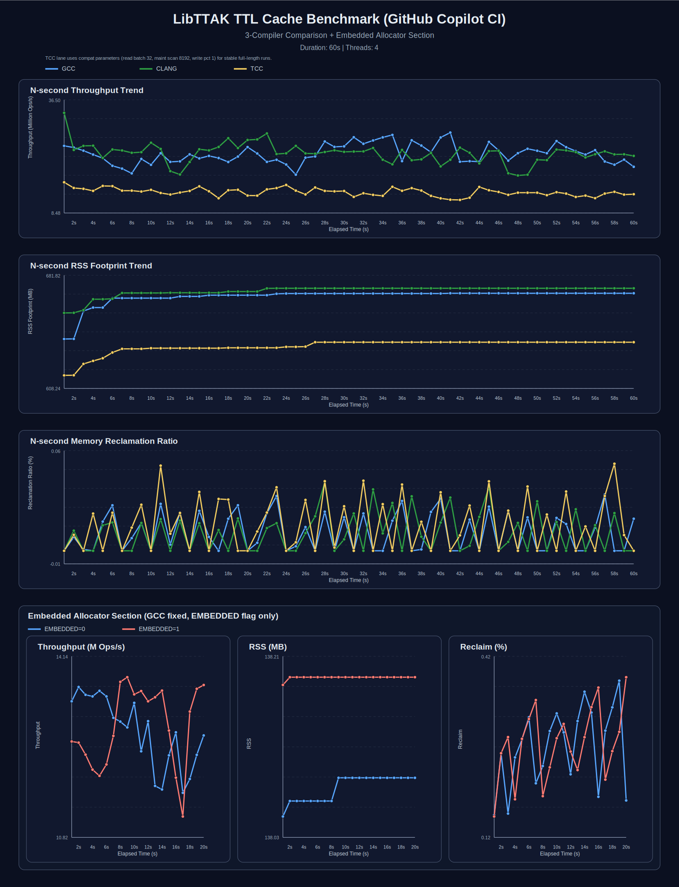

# libttak

**Deterministic systems runtime for C.**

libttak is a low-level runtime focused on predictable memory behavior,
high-throughput concurrency, and deterministic resource scheduling.

It powers higher-level systems such as:

- custom web frameworks
- network routing layers
- lock-free ingress pipelines
- containerized services
- experimental overlay networking systems

This project intentionally avoids treating memory allocation,
network scheduling, and concurrency as isolated subsystems.

Instead, libttak attempts to unify them under deterministic control.

---

## Why this exists

Traditional C applications often fail in predictable ways under scale:

- fragmented heap growth
- allocator contention
- unstable tail latency
- difficult async coordination
- inconsistent resource ownership

libttak was built to reduce those failure modes.

It provides explicit lifecycle control while preserving high throughput.

---

# Core Components

## Memory

### Generational Arena

Batched allocations with explicit generation cleanup.

- timestamped generations
- bulk reclamation
- predictable cleanup boundaries

---

### Epoch Reclamation

Cross-thread memory reclamation without global pauses.

- retire lists
- quiescence checks
- delayed safe reclamation

---

### Ownership Model

Explicit ownership semantics for long-lived allocations.

- detachable allocations
- owner tracking
- VMA-backed regions
- fast-path allocation shortcuts

---

## Concurrency

### Futures / Promises / Tasks

Internal async primitives:

- futures
- promises
- task scheduling
- worker coordination

---

### Thread Pools

Explicit worker orchestration without hiding scheduling behavior.

---

## Networking

### Deterministic Lattice Scheduler

This is one of libttak's experimental scheduling layers.

It uses deterministic coordinate selection inspired by
orthogonal Latin square (OLS) constructions.

This is used for:

- parallel ingress balancing
- contention reduction
- deterministic slot routing
- burst dispersion

This is **not marketed as formal academic MOLS research**.

It is a systems scheduling experiment inspired by historical
construction techniques.

---

### Adaptive Burst Prevention

Ingress bursts are detected through weighted routing signals.

The scheduler rotates traffic directions to prevent concentrated hotspots.

---

### Zero-copy IO

- async IO
- sync IO
- zero-copy paths
- platform-aware optimizations

---

## Data Structures

- hash tables
- pools
- ring buffers
- trees
- priority queues
- B+ trees
- schedulers

---

## Math / Acceleration

libttak includes optional computational modules:

- bigint
- bigreal
- matrix operations
- NTT
- CUDA
- OpenCL
- ROCm acceleration

These modules are optional and isolated from core runtime usage.

---

# Performance

## CI Benchmark (Reproducible Baseline)

The public benchmark shown below runs in GitHub CI because it is fully reproducible.

Environment:

- GitHub Actions / Copilot CI
- KVM virtualized environment
- Intel Xeon Platinum 8272CL
- 3 vCPU
- 17 GB RAM

Benchmark target:

`bench/ttl-cache-multithread-bench/ttl_cache_bench_lockfree`

Configuration:

- 20 second runtime
- auto thread detection
- 2 worker threads
- 1 maintenance thread

Results:

- Peak throughput: **13.9M ops/sec**
- Average throughput: **10.0M ops/sec**
- Final RSS: **~266 MB**

These numbers should be treated as a **minimum reproducible baseline**, not peak hardware capability.

CI runners introduce:

- virtualization overhead
- noisy neighbors
- inconsistent CPU scheduling
- lower sustained boost behavior

:contentReference[oaicite:0]{index=0}

---

## Bare Metal Benchmark

On physical Ryzen servers, the same benchmark has already reached
the throughput numbers referenced in earlier internal documentation
without CI virtualization penalties.

Bare-metal runs consistently outperform GitHub CI due to:

- higher sustained clocks
- better cache behavior
- no hypervisor scheduling overhead
- more stable thread placement

The CI benchmark remains published because anyone can reproduce it.

The Ryzen benchmark reflects real deployment behavior.

---

# Documentation

Full documentation is generated through Doxygen.

GitHub Pages documentation:

https://religiya-serdtsa.github.io/libttak/

Documentation is rebuilt automatically on every push to `main`.

---

# Philosophy

libttak is not trying to become:

- another generic STL clone
- another malloc wrapper
- another async abstraction layer

The goal is narrower:

build deterministic infrastructure primitives that remain stable under sustained load.

Predictability matters more than marketing throughput numbers.
