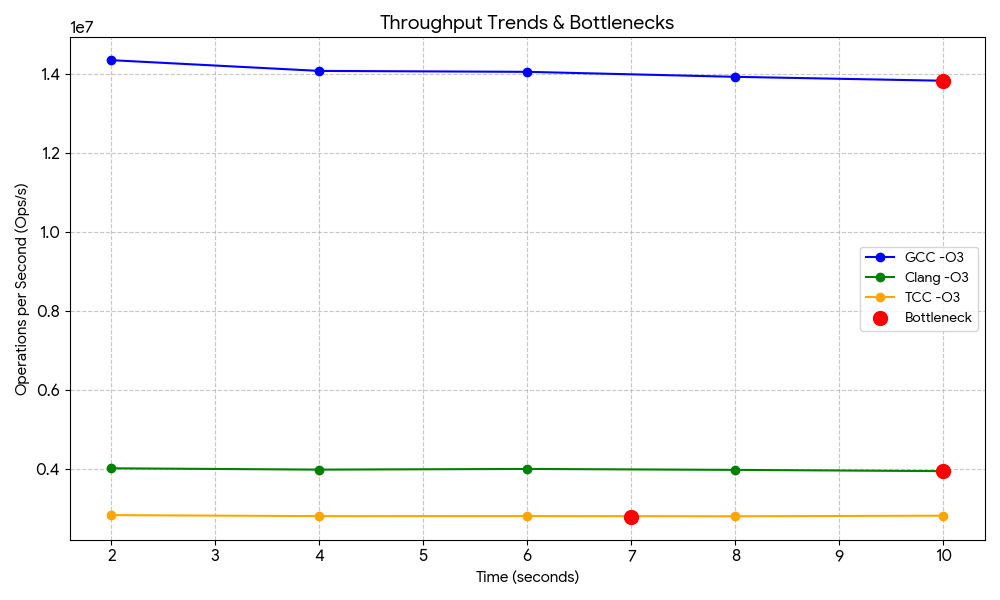
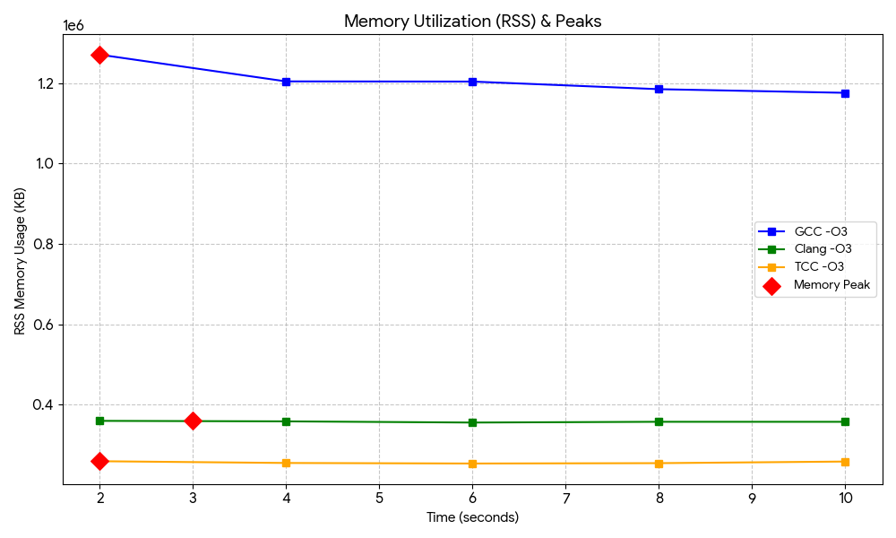

## Performance Comparison Report
(Linux x64, Ryzen 5600X, 64GB DDR4 3200MHz)

| Metric Category | Metric | GCC -O3 | TCC -O3 | Clang -O3 |
| --- | --- | --- | --- | --- |
| Throughput | Operations per Second (Ops/s) |  |  |  |
| Logic Integrity | Cache Hit Rate (%) |  |  |  |
| Resource Usage | RSS Memory Usage (KB) |  |  |  |
| GC Performance | CleanNsAvg (Nanoseconds) |  |  |  |
| Runtime Control | Total Epochs Transitioned |  |  |  |
| Data Retention | Items in Cache (Final) |  |  |  |
| Memory Recovery | Retired Objects Count |  |  |  |

---

LibTTAK and this benchmark had a same compiler (e.g. GCC LibTTAK/GCC Benchmark) in this experiment.
Benchmark program's optimization was left as `-O0`, while following the same compiler.

## Detailed Performance Analysis

### Time-series Raw Data (Sampled)

| Time (s) | GCC Ops/s | TCC Ops/s | Clang Ops/s | GCC RSS (KB) | TCC RSS (KB) | Clang RSS (KB) |
| --- | --- | --- | --- | --- | --- | --- |
| 2 | 14,341,859 | 2,826,011 | 4,011,358 | 1,271,236 | 259,080 | 359,552 |
| 4 | 14,070,020 | 2,800,807 | 3,977,778 | 1,204,668 | 254,688 | 358,296 |
| 6 | 14,046,444 | 2,801,910 | 3,994,964 | 1,204,244 | 253,364 | 355,348 |
| 8 | 13,920,250 | 2,796,934 | 3,971,204 | 1,185,284 | 254,252 | 357,236 |
| 10 | 13,821,147 | 2,811,931 | 3,939,376 | 1,176,200 | 258,268 | 357,172 |

---

### Throughput & Bottleneck Trends

### Memory Utilization & Peak Analysis

---

**Analysis Summary:**

* **GCC Bottleneck:** Observed at 10s where `CleanNsAvg` latency peaks, causing a minor dip in Ops/s due to heavy metadata overhead in `mem_tree` during massive epoch reclamation.
* **Memory Management:** Peak RSS for GCC occurs early at 2s, suggesting aggressive initial allocation for shard buffers, whereas TCC/Clang remain stable with lower throughput-driven pressure.
