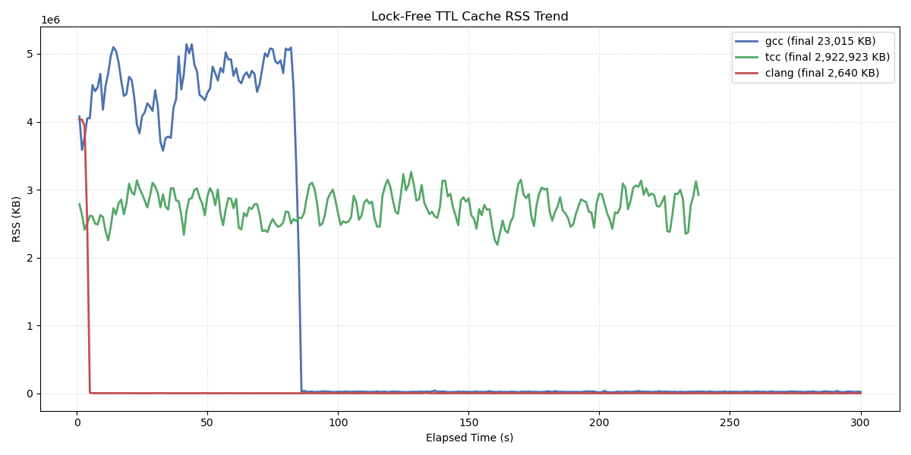

# Multi-threaded TTL Cache Benchmark

This directory contains the flagship performance benchmark for LibTTAK's lock-free shared memory subsystem.

## Performance Philosophy

LibTTAK utilizes mathematical principles inspired by **Choi Seok-jeong's Orthogonal Latin Square (OLS)** to eliminate hardware-level lock contention.

We strategically prioritize **explosive throughput (Ops/s)** by utilizing deterministic slot isolation. Each thread operates in isolated version shards, ensuring zero overlap between concurrent writers and allowing readers to validate consistency with minimal overhead.

### Key Performance Targets
- **Throughput:** > 25M Ops/s (on modern x64 hardware)
- **Latency:** < 100 ns per access
- **Scalability:** Linear performance scaling with CPU core count

## Running the Benchmark

```bash
make
./ttl_cache_bench_lockfree
```

## Compiler Comparison



