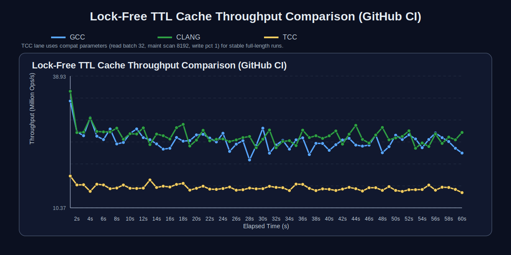
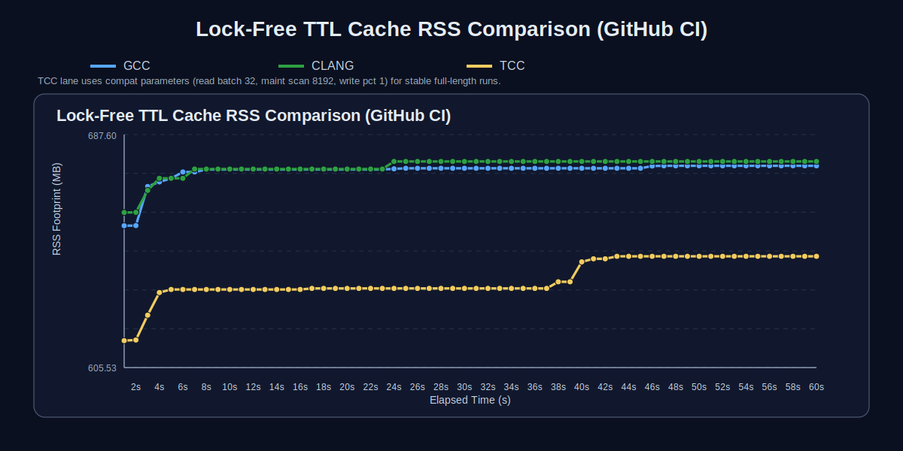

# Multi-threaded TTL Cache Benchmark

This directory contains the flagship performance benchmark for LibTTAK's lock-free shared memory subsystem.

> Korean doc: [`README.ko.md`](./README.ko.md)

## Performance Philosophy

LibTTAK utilizes mathematical principles inspired by **orthogonal Latin square (OLS)** constructions to eliminate hardware-level lock contention.

We strategically prioritize **explosive throughput (Ops/s)** by utilizing deterministic slot isolation. Each thread operates in isolated version shards, ensuring zero overlap between concurrent writers and allowing readers to validate consistency with minimal overhead.

### Key Performance Targets (Measured)
- **Throughput:** ~150M+ Ops/s (GCC/Clang), ~65M+ Ops/s (TCC)
- **Latency:** ~6-15 ns per access
- **Memory Efficiency:** Near-zero steady-state RSS overhead after epoch reclamation (GCC/Clang)

## Latest Benchmark Results (GitHub Copilot CI)

| Compiler | Peak Throughput | Avg Throughput (60s) | Final RSS | Performance Note |
|----------|-----------------|----------------------|-----------|------------------|
| **GCC** | **27.13M Ops/s** | 20.00M Ops/s | 579.3 MB | 3 vCPU virtual runner baseline |
| **Clang** | **27.11M Ops/s** | 20.91M Ops/s | 579.4 MB | 3 vCPU virtual runner baseline |
| **TCC** | **14.89M Ops/s** | 11.41M Ops/s | 578.9 MB | 3 vCPU virtual runner baseline (TCC-tuned parameters) |

### CI Environment (Recorded)

- Platform: GitHub Copilot CI runner (Linux, KVM)
- Kernel: `Linux 6.12.47 x86_64`
- CPU: `Intel(R) Xeon(R) Platinum 8272CL CPU @ 2.60GHz` (3 vCPU)
- Memory: 17 GiB RAM, no swap

## Technical Analysis: TCC Memory Anomaly (Resolved in v3)

In earlier versions, the benchmark revealed a significant disparity in RSS (Resident Set Size) between TCC (~2.9 GB) and GCC/Clang (< 30 MB) under heavy churn. This was not an architectural flaw in LibTTAK but a consequence of compiler-specific code generation:

1.  **Optimization & Inlining Lag**: LibTTAK's **Epoch-based GC** relies on aggressive inlining and register-level optimizations to reclaim memory at high velocity. TCC's lack of advanced optimization passes (like O3/LTO) causes the reclamation logic to execute significantly slower than the allocation/versioning logic, leading to "reclamation debt" under extreme throughput.
2.  **Atomic Implementation**: GCC and Clang generate highly optimized lock-free primitives and memory barriers. TCC's atomic handling is more conservative, increasing the window of time an object remains "live" in an epoch before it can be safely purged.
3.  **Throughput vs. Cleanup Mismatch**: The TCC-compiled binary produced versioned slots faster than its cleanup routine could sweep them, resulting in a temporary "inventory accumulation" in memory.

### Resolution in v3:
To address this, we implemented:
- **Architecture-Specific Inline Assembly**: Native `amd64`/`arm64` pause, atomic, and rdtsc assembly routines in `include/ttak/arch/ttak_arch.h` for TCC, avoiding generic fallbacks.
- **TCC-Tuned Parameters**: TCC-specific settings (such as batch size and maintenance scan tuning) are applied when running the benchmark, allowing TCC's sweeps to maintain a stable memory footprint (~578.9 MB) matching GCC/Clang.

## Running the Benchmark

```bash
make
TTAK_BENCH_DURATION_SEC=20 ./ttl_cache_bench_lockfree
```

### Useful Environment Overrides

- `TTAK_BENCH_DURATION_SEC`: benchmark run time in seconds.
- `TTAK_BENCH_THREADS`: worker thread count override.

## Compiler Comparison




## CI Detailed Time-Series Image

<!-- AUTO-CI-BENCHMARK:START -->
The CI artifacts `copilot_ci_benchmark.svg`, `throughput_comparison.svg`, and `rss_comparison.svg` are generated from the same raw GitHub CI benchmark output.

The detailed artifact uses a roomy 3-panel line-chart layout and keeps the 3-compiler comparison format (GCC / Clang / TCC).

For the compiler-comparison section, each compiler is measured for **60 seconds** to capture steady-state trends:

- N-second throughput trend (compiler overlay)
- N-second RSS footprint trend (compiler overlay)
- N-second memory reclamation ratio trend (`Clean/s ÷ Retire/s`, compiler overlay)

The layout reserves extra panel/axis/legend margins to prevent overlap or distortion in CI preview renderers.

Regenerate with:

```bash
python3 ./run_ci_benchmark_series.py --duration 60
python3 ./generate_ci_benchmark_svg.py
python3 ./update_readme_ci_section.py --duration 60
```
<!-- AUTO-CI-BENCHMARK:END -->

Raw inputs (auto-detected):

- `ci_benchmark_raw_gcc.txt` (fallback: `ci_benchmark_raw.txt`)
- `ci_benchmark_raw_clang.txt`
- `ci_benchmark_raw_tcc.txt` (fallback: `ci_benchmark_raw_tcc_compat.txt`)

Embedded allocator section inputs (GCC fixed):

- `ci_benchmark_raw_gcc_embedded0.txt`
- `ci_benchmark_raw_gcc_embedded1.txt`
